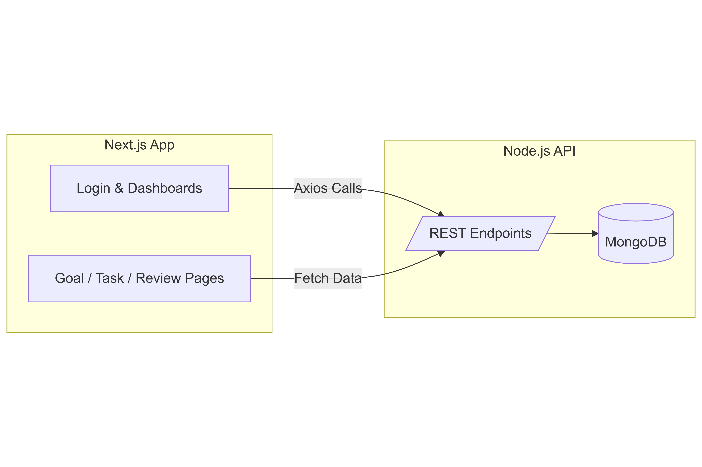

---

## 🌐 **2️⃣ Frontend – `revx-fe` (Next.js + Tailwind + NextAuth)**

```markdown
# 💼 RevX Frontend – Employee Performance Review System (Client)

The **RevX Frontend** provides an interactive interface for HR Admins, Managers, and Employees to collaborate in the performance review process.  
Built using **Next.js**, **NextAuth**, and **Tailwind CSS**.

---

## 🧠 Project Overview

- Role-based dashboards for HR, Manager, and Employee  
- Goal and task tracking with progress indicators  
- Self-assessment and feedback submission  
- Performance review scheduling and notifications  
- Data-driven analytics and reports  

---

---

## 🏗️ Tech Stack

| Technology | Description |
|-------------|-------------|
|  | JavaScript runtime for backend |
|  | Web application framework |
|  | NoSQL database |
|  | JSON Web Token authentication |
|  | Email notification system |
|  | Automated review reminders |

---


## 🧬 System Architecture

The following diagram illustrates the overall architecture of the **RevX Frontend Application**:

<p align="center">
  
</p>
